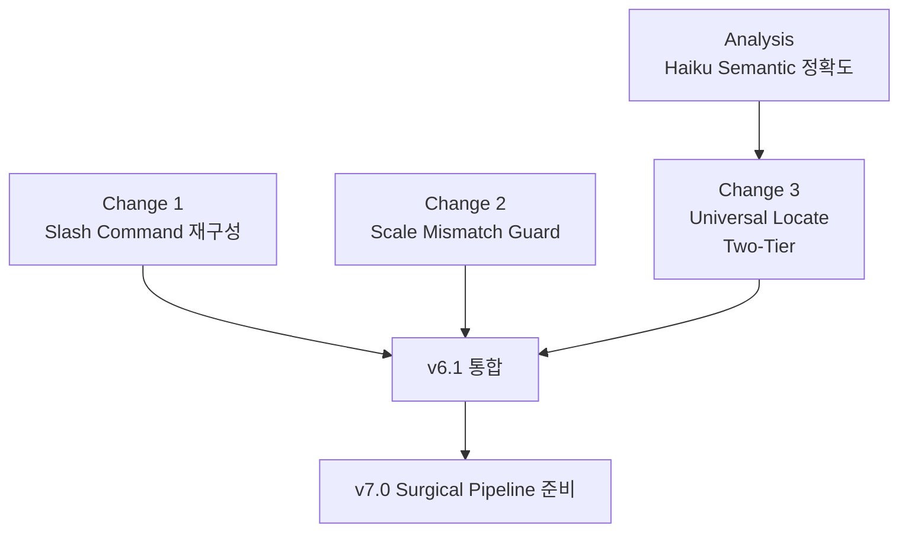

# RFC v6.1 — Precision & Locate (UX 마찰 제거 + 결과물 품질 일관성)

> **Status**: Draft / Discussion
> **Depends on**: v6.0.1 (이미 머지 또는 머지 대기)
> **Blocks**: v7.0 surgical pipeline
> **Created**: 2026-04
> **Decision deadline**: 사용자 검토 후

---

## Context

v6.0.1 패치(에이전트 모델 frontmatter + review-gate 기본값 하향)를 머지하고 나서도, Vela 파이프라인에는 *근본적인 비용·품질 misalignment*가 남아 있다. 사용자가 실제 측정한 데이터:

- electron 앱에 파일 검색 기능 추가 (1개 모듈, 단일 기능):
  - research(exploratory) **67.5k 토큰 / 4분 31초**
  - planner ×2 (REJECT 1회 → 재작성) **150k 토큰**
  - reviewer ×3 **214k 토큰**
  - plan-checker **19.3k 토큰**
  - → plan 단계까지만 ~385k 토큰, ~26분 (Claude Max 한도 6% 소비)

이 작업의 본질은 *"파일 한 개에 함수 하나 추가"*인데 광범위 프로젝트 분석이 발동했다. 이 v6.1 RFC는 그 misalignment의 **세 가지 근본 원인**을 해결한다:

1. **scale 자동 감지의 임의성** — `vela-engine.js:1314`의 `autoDetectScale()`이 단어 수만으로 large 분류 (>30 단어면 무조건 large)
2. **사용자가 large를 명시 선택해도 catch할 수단 없음** — 작업 무게가 명백히 가벼워도 PM이 그대로 진행
3. **모든 scale에 좌표 식별이 결정론적이지 않음** — small/medium/ralph/hotfix는 PM/executor가 추측으로 파일 찾기 → 잘못된 파일 수정 위험 + 결과물 비결정론

---

## 의도한 결과

| 차원 | 변경 후 |
|---|---|
| **품질 일관성** | 같은 작업 요청 → 같은 targets.json → 같은 결과물. 모든 scale에서 결정론적 좌표 보장. |
| **비용** | research 자동 발동 차단(약 67k+ 절감/회). 평균 작업당 추가 LLM 비용 ~1k 미만. |
| **UX 마찰** | scale 선택 AskUserQuestion 1단계 제거 (slash command가 의도 표현). |
| **사용자 의도 존중** | scale guard는 *제안*만, 자동 변경 절대 금지. 첫 옵션 항상 "그대로 진행". |

---

## 구성 — 세 개의 독립 변경 + 한 개의 분석



세 변경은 독립적으로 머지 가능하지만, 함께 적용해야 효과가 극대화된다:
- Change 1: scale 의도가 명시화됨
- Change 2: 명시화된 scale이 실제 작업에 맞는지 한 번 더 검증
- Change 3: 검증 통과한 scale에서 결정론적으로 좌표 확정

---

## Change 1 — Slash Command 재구성 (UX 마찰 제거)

### 현 흐름의 문제

```
/vela:start 인증 추가
  ↓
PM: AskUserQuestion("scale을 선택하세요: small/medium/large")  ← 마찰 1
  ↓
PM: AskUserQuestion("이대로 진행할까요?")                       ← 마찰 2
  ↓
파이프라인 시작
```

추가로 `vela-engine.js:1314-1319`의 `autoDetectScale()`은 단어 수만으로 결정:
```javascript
function autoDetectScale(request) {
  const words = request.split(/\s+/).length;
  if (words <= 10) return "small";
  if (words <= 30) return "medium";
  return "large";  // ← 31단어 이상이면 무조건 large
}
```

→ 작업의 *무게*가 아니라 *프롬프트 길이*로 scale이 결정됨. "OAuth 추가"는 small이지만 large가 적절한 케이스 多, 반대로 30단어 넘는 typo 수정도 large 분류.

### 변경 흐름

```
/vela:large 인증 시스템에 OAuth 추가
  ↓
PM: prompt-optimizer 자동 (필요 시만 보완)
  ↓
node .vela/cli/vela-engine.js init "..." --scale large
  ↓
파이프라인 즉시 시작
```

**AskUserQuestion 0회**, prompt-optimizer는 *진짜로 모호한 경우*에만 작동.

### 명령어 매핑

| 새 명령 | Scale | Pipeline | 단계 수 | 사용 케이스 |
|---|---|---|---|---|
| `/vela:small` | small | trivial | 4 | 한 줄 수정, typo, 단순 추가 |
| `/vela:medium` | medium | quick | 6 | 명확한 기능 추가 (대부분의 일상 작업) |
| `/vela:large` | large | standard | 12 | 광범위 설계, critical path |
| `/vela:ralph` | ralph | ralph | 5+루프 | TDD 버그 수정 (테스트 통과까지 반복) |
| `/vela:hotfix` | hotfix | hotfix | 3 | 문서/설정/README |
| `/vela` | (메뉴) | — | — | 아무 인자 없을 때만 AskUserQuestion 메뉴 |

기존 명령은 그대로 유지: `/vela:status`, `/vela:analyze`, `/vela:git-clean`, `/vela:update`, `/vela:sprint`

### 마이그레이션 — `/vela:start` deprecation

**v6.1 단계** (deprecation):
- `/vela:start <task>` 호출 시 → *"⚠️ /vela:start는 deprecated. /vela:medium 또는 /vela:large를 사용하세요"* 경고
- 그래도 실행은 됨 (medium 폴백)
- `autoDetectScale()` 함수 폐기, `--scale` 누락 시 **medium 폴백** + 경고 표시

**v7.0 단계** (제거):
- `/vela:start` 완전 제거
- `autoDetectScale()` 함수 삭제
- `/vela` 단독 호출 시 메뉴에 새 명령 안내

### 영향 파일 (~8개)

- `SKILL.md` — `/vela:start` 섹션 → `/vela:{scale}` 섹션으로 재작성, 매핑 표 추가
- `skills/start/SKILL.md` — deprecation 경고 또는 5개 새 skill 파일로 분할
- `scripts/agents/vela.md` — "PM이 첫 행동: state 확인 → scale 명령어 매핑 인식"
- `scripts/cli/vela-engine.js` — `autoDetectScale()` 폐기, `--scale` 누락 시 medium 폴백
- `scripts/agents/pm/pipeline-flow.md` — scale 선택 AskUserQuestion 절차 삭제
- `references/interactive-ui.md` — scale 선택 UI 템플릿 삭제
- `evals/evals.json` — `/vela:start` 참조 → 새 명령어로 교체
- `README.md` — 명령어 사용법 갱신

### 결정 필요 (Q1~Q3)

- **Q1. 명령 이름**:
  - A. **Scale 명**: `/vela:small`, `/vela:medium`, `/vela:large` ← **권장** (단순, 직관)
  - B. **Pipeline 명**: `/vela:trivial`, `/vela:quick`, `/vela:standard` (internal 이름 노출)
  - C. **Intent 명**: `/vela:fix`, `/vela:add`, `/vela:design` (학습 곡선 ↑)

- **Q2. `/vela:start` 처리**:
  - A. 즉시 제거 (clean break)
  - B. **v6.1 deprecation 경고만, v7.0 완전 제거** ← **권장** (기존 사용자 보호)
  - C. 영구 alias로 유지 (= `/vela:medium`)

- **Q3. `--scale` 누락 시 동작**:
  - A. **에러** (사용자가 명시 강제)
  - B. **medium 폴백 + 경고** ← **권장** (가장 안전한 기본값)
  - C. autoDetectScale 유지 (현재와 동일, 임의성 문제 그대로)

---

## Change 2 — Scale Mismatch Guard (PM 사전 점검)

### 문제 정의

사용자가 `/vela:large`를 명시 선택했어도, 실제 작업이 단일 파일 typo 수정 같은 가벼운 일이라면 large 12단계 + research 67k는 명백히 과하다. 반대로 `/vela:small`을 선택했는데 작업이 신규 모듈 추가라면 small 4단계로는 부족하다.

현재 Vela는 사용자 선택을 그대로 따른다. 이는 *"의도 존중"*이지만 동시에 *"비용·품질 misalignment를 catch할 기회 상실"*이기도 하다.

### 설계 원칙 — 사용자 의도 절대 우선

1. **자동 변경 금지** — PM은 절대로 사용자가 선택한 scale을 자기 마음대로 바꾸지 않는다.
2. **제안만 제공** — 명백한 mismatch 신호가 있을 때만 AskUserQuestion으로 *제안*한다.
3. **첫 옵션은 항상 "변경 안 함 (사용자 의도 존중)"** — 사용자가 무심코 Enter 쳐도 원래 선택이 유지됨.
4. **약한 신호는 무시** — 노이즈 방지. heuristic 신호가 강할 때만 발동.

### 작동 흐름

```
/vela:large auth.ts의 typo 수정
  ↓
PM: prompt-optimizer 단계에서 다음을 동시 수행
  - 프롬프트 충분성 검사 (기존 동작)
  - scale 적합성 평가 (신규)
  ↓
PM heuristic:
  - 작업 키워드 분석: "typo 수정"
  - 추정 범위: 단일 파일, 1-2줄
  - 사용자 선택: large
  - 신호: 강한 mismatch (large가 ~7배 과함)
  ↓
PM AskUserQuestion:
"⛵ Scale 점검 — 이 작업은 large보다 가벼워 보입니다.

작업: auth.ts typo 수정 (추정: 단일 파일, 1-2줄)
현재 scale: large (12단계, research 포함, 추정 ~700k 토큰)
권장 scale: small (4단계, 추정 ~30k 토큰)

선택:"
options:
  1. "large 그대로 진행 (사용자 의도 존중)" ← 첫 번째, 안전 기본값
  2. "small로 변경 (~95% 비용 절감)"
  3. "medium으로 절충 (6단계, ~150k 토큰)"
  4. "취소"
```

핵심: **첫 옵션이 "그대로 진행"**이라 사용자가 빠르게 무시할 수 있다. 제안은 정보 제공이지 강제가 아니다.

### Heuristic 신호 (보수적으로 시작)

scale mismatch 판정은 *명백한 신호일 때만* 발동한다. 애매하면 무시.

**Downgrade 신호 (선택보다 작아 보임)**:
- 키워드: `typo`, `주석`, `오타`, `comment`, `포맷팅`, `들여쓰기`, `한 줄`, `하나만`
- 프롬프트가 단일 파일 + 단일 함수 + 단일 동작에 명시적으로 한정
- 작업 설명이 20단어 미만 + 명확한 좌표 (예: "auth.ts:42")

**Upgrade 신호 (선택보다 커 보임)**:
- 키워드: `마이그레이션`, `migration`, `리팩토링`, `refactor`, `재설계`, `전체`, `시스템`, `보안`, `인증`, `결제`, `OAuth`, `aggregate`
- 여러 모듈 언급 (3+ 파일/디렉토리)
- "신규" + "기능" 조합

### 판정 매트릭스

| 사용자 선택 | downgrade 신호 강함 | upgrade 신호 강함 | 신호 없음/약함 |
|---|---|---|---|
| /vela:small | — | medium 또는 large 제안 | 그대로 |
| /vela:medium | small 제안 | large 제안 | 그대로 |
| /vela:large | small 또는 medium 제안 | — | 그대로 |
| /vela:ralph | (제안 안 함) | (제안 안 함) | 그대로 |
| /vela:hotfix | (제안 안 함) | (제안 안 함) | 그대로 |

ralph/hotfix는 의도가 매우 specific하므로 mismatch 점검 대상에서 제외 (TDD 루프 / 문서 수정은 사용자가 명확히 알고 선택하는 경우).

### 구현 위치 — `prompt-optimizer.md` 확장

새 파일 추가 없이 기존 PM 절차에 통합:

- **`scripts/agents/pm/prompt-optimizer.md`** — 보완 단계 직후, init 직전에 scale 적합성 heuristic 평가 → 강한 mismatch 시 AskUserQuestion 한 번 더
- **`scripts/agents/vela.md`** — "세션 시작 필수 동작" 섹션 옆에 "Scale 적합성 점검" 절차 추가
- **`references/interactive-ui.md`** — "Scale 점검" AskUserQuestion 템플릿 추가

**엔진 변경 없음**: `vela-engine.js`는 변경하지 않는다. 이건 PM 오케스트레이션 레벨의 가드이지 엔진 레벨의 강제가 아니다.

### 사용자 옵트아웃

`.vela/config.json`에 새 필드:

```json
{
  "scale_guard": {
    "enabled": true,
    "thresholds": {
      "downgrade_signals_min": 2,
      "upgrade_signals_min": 2
    }
  }
}
```

`scale_guard.enabled: false`로 설정하면 scale 점검 건너뛰고 사용자 선택을 그대로 진행. 기본값은 enabled: true. `templates/config.json`은 `skipOnUpgrade: true`로 보호되므로 기존 사용자 영향 없음.

### 결정 필요 (Q4~Q6)

- **Q4. heuristic 위치**:
  - A. **PM 오케스트레이션 (vela.md + prompt-optimizer.md)** ← **권장** (새 코드 적음)
  - B. vela-engine.js init 명령 (결정론적, 캐시 가능, 하지만 엔진에 한국어 키워드 매칭 들어감)
  - C. 별도 vela-scale-checker 에이전트 (추가 LLM 호출, 비용 ↑)

- **Q5. mismatch 발견 시 기본 옵션 순서**:
  - A. **"그대로 진행" 첫 번째** ← **권장** (안전, 사용자 의도 존중)
  - B. "권장 scale로 변경" 첫 번째 (PM 판단 신뢰)
  - C. 항상 4개 옵션 (그대로/권장/절충/취소) 동일 표시

- **Q6. ralph/hotfix 제외**:
  - A. **제외** ← **권장** (의도가 specific하므로 점검 안 함)
  - B. 포함 (모든 scale에 점검 적용)
  - C. 제외하되 hotfix는 "이게 정말 단순 문서/설정이 맞나요?" 한 번 확인

### ROI

이 가드 자체의 비용:
- Heuristic 평가: 0 토큰 (PM이 이미 프롬프트를 읽고 있음, 키워드 매칭만 추가)
- AskUserQuestion 1회 추가: 거의 0 토큰 (UI 호출)
- 사용자 결정 시간: ~3-5초

방지하는 비용 (단 1회 발동 시):
- large→small 전환: 약 700k → 30k 토큰 (~95% 절감, ~30분 → ~3분 단축)
- large→medium 전환: 약 700k → 150k 토큰 (~78% 절감)

**가드의 ROI는 매우 크다** — 발동 1회당 수십만 토큰 절감 가능, 발동되지 않을 때의 비용은 0에 가깝다.

---

## Change 3 — Universal Locate (모든 scale의 결과물 품질 일관성)

### 문제

`templates/pipeline.json` 정밀 검증 결과:

| 사용자 선택 | scales 매핑 | pipeline_type | research 단계 포함? |
|---|---|---|---|
| `/vela:small` | trivial | trivial | ❌ |
| `/vela:medium` | quick | quick | ❌ (line 178) |
| **`/vela:large`** | standard | standard | **✅** (12 steps 전체) |
| `/vela:ralph` | ralph | ralph | ❌ (line 212) |
| `/vela:hotfix` | hotfix | hotfix | ❌ (line 236) |

**결정적 사실**: research(67k+ 토큰)는 **오직 large/standard에서만** 발동된다. 다른 4개 scale은 research를 완전히 건너뛴다.

그런데 이게 *오히려 다른 문제*를 만든다: small/medium/ralph/hotfix는 *"어디를 만질 것인가"를 결정론적으로 식별하는 단계 자체가 없다*. PM과 executor가 사용자 표현을 그대로 받아 grep 양·정확도를 매번 다르게 수행한다.

결과:
1. **잘못된 파일 수정 위험** — 사용자가 "auth.ts의 login 수정"이라 했지만 실제 파일이 `authentication.ts`이거나 함수가 `signIn`인 경우 catch 못 함
2. **결과물 비결정론** — 동일한 요청을 두 번 돌리면 매번 다른 파일을 만질 수 있음
3. **품질 일관성 부재** — small과 large에서 같은 작업을 했을 때 결과가 다름

이는 large/surgical 전용 문제가 아니라 **모든 scale의 공통 결함**이다. v7.0 surgical에 한정하지 말고 v6.1에서 해결해야 한다.

### 핵심 발견 — locate는 LLM이 필요 없다

좌표 식별의 90%는 결정론적 grep/glob/import-graph 분석으로 가능하다. 따라서 **새 LLM 에이전트가 아니라 `vela-engine.js`의 새 명령**으로 구현한다.

### 설계 — Two-Tier Locate

```
1단계: mechanical locate (vela-engine.js, LLM 0, 1-2초)
  - 작업 description에서 식별자 추출 (regex: \w+\.(ts|js|py|go|rs|md), \b[A-Z]\w+\b, function \w+, etc.)
  - 사용자가 명시한 토큰을 ripgrep으로 직매칭
  - 매칭 파일에 대해 import graph 분석 (existing change-surface.js 재활용)
  - blast_radius 계산
  - confidence 평가 (high: 매칭 명확 / medium: 일부 모호 / low: 매칭 없음)
  ↓
high → targets.json 그대로 출력 → 다음 단계
medium → targets.json + warning 출력 → PM이 AskUserQuestion으로 확인
low → 2단계 폴백
  ↓
2단계: semantic locate (Haiku, ~3-5k 토큰만, 폴백 시만)
  - 한국어/추상 키워드를 영어 식별자로 추측 ("로그인" → ["login","signIn","authenticate","auth"])
  - 추측 결과를 다시 1단계에 입력
  - 여전히 low → PM에게 AskUserQuestion으로 사용자 확인 요청
```

**평균 LLM 비용**:
- 명시적 요청 (`/vela:medium auth.ts:42 검증 추가`): **0** (mechanical 직매칭)
- 절반 명시적 (`auth.ts의 login 함수 수정`): **0** (mechanical high)
- 추상적 (`로그인 검증 추가`): **~3-5k** (Haiku semantic 폴백)
- 완전 모호: **0** + 사용자 질문

대부분의 일상 작업은 첫 두 케이스 → 평균 비용 거의 0.

### 결과물 — `targets.json` 스키마

```json
{
  "primary": [
    {
      "file": "src/auth.ts",
      "symbol": "loginHandler",
      "lines": "42-89",
      "match_source": "exact"
    }
  ],
  "tests": [
    {
      "file": "src/auth.test.ts",
      "reason": "covers loginHandler",
      "match_source": "import_graph"
    }
  ],
  "blast_radius": [
    {
      "file": "src/middleware/auth.ts",
      "reason": "imports loginHandler",
      "match_source": "import_graph"
    }
  ],
  "confidence": "high",
  "tier": "mechanical",
  "warnings": []
}
```

`primary[]`가 비어있으면 → init이 차단되고 PM이 사용자에게 질문.

### 새 매트릭스 — 모든 scale에 locate 적용

| Scale | 단계 흐름 | locate 활용 |
|---|---|---|
| **small** | init → **locate** → execute → commit → finalize | executor가 targets.json 그대로 사용 |
| **medium** | init → **locate** → plan → execute → verify → commit → finalize | plan이 targets 기반 작성 |
| **large** | init → **locate** → research(targeted/exploratory) → plan → ... → finalize | research가 좁은 범위 자동 활성화 |
| **ralph** | init → **locate** → execute ↔ verify → commit → finalize | 첫 사이클부터 정확한 위치 |
| **hotfix** | init → **locate** → execute → commit | 사용자 명시 파일 검증 |

→ 모든 scale에 동일한 사전 검증, **단계 수는 +1**, **추가 LLM 비용 평균 0**

### 잠자던 자산 활용 — `targeted` mode

**`scripts/agents/researcher/index.md:11`에 `targeted` mode가 이미 정의되어 있다.** `scripts/agents/vela-researcher.md`(v6 계승, v7.3 M1에서 v4.1 `researcher.md` 루트 파일 제거)에 분석 절차와 research.md 섹션 분기까지 완성되어 있다. `scripts/agents/researcher/hypothesis.md:3`은 *"좁은 범위 요청에서는 가설 절차를 적용하지 않고 관련 파일과 직접 의존성만 분석한다"*를 명시한다.

문제: PM이 `project_mode`를 결정하는 명시적 로직이 어디에도 없어서, `vela-researcher.md:18`의 기본값 `exploratory`로 떨어진다. **targeted mode는 코드는 있지만 한 번도 발동된 적이 없다.**

locate가 도입되면 자동으로 깨어난다:
- locate confidence: high → `project_mode: targeted` (좁은 범위 분석)
- locate confidence: low or 좌표 없음 → `project_mode: exploratory` (현 동작)
- 신규 프로젝트 (코드 없음) → `project_mode: bootstrap`

PM이 `vela-engine.js init`에 `--project-mode` 플래그로 전달, `vela.md`의 research 호출 프롬프트에 자동 주입.

### 영향 파일 (대략 5-7개)

**신규 명령 (vela-engine.js 확장)**:
- `scripts/cli/vela-engine.js` — `cmdLocate()` 함수 추가
  - args: 없음 (현재 active pipeline의 request에서 자동 추출)
  - output: `{artifactDir}/targets.json`
  - 기존 함수 재사용:
    - `findActiveState()` (line 1012) — 현재 파이프라인 상태 읽기
    - `gitExec()` (line 1441) — git ls-files 활용
    - `change-surface.js`의 import 그래프 로직 (재활용 가능)
- `scripts/shared/locate.js` (신규) — mechanical locate 구현 (식별자 추출 + grep + graph 분석)

**파이프라인 정의**:
- `templates/pipeline.json` — 모든 pipelines에 `locate` step 추가, exit_gate `targets_json_exists` 신규
- `scripts/cli/vela-engine.js` `checkExitGate()` — `targets_json_exists` case 추가

**에이전트 통합**:
- `scripts/agents/vela.md` — 각 단계 절차에 "locate 결과 활용" 추가, locate step 오케스트레이션
- `scripts/agents/vela-executor.md` — input에 `targetsPath` 추가, plan.md 외에 targets.json도 참조
- `scripts/agents/vela-planner.md` — input에 `targetsPath` 추가
- `scripts/agents/vela-researcher.md` — input에 `targetsPath` 추가, project_mode를 targets.confidence로 자동 결정

**Semantic fallback agent (옵션, 2-tier 시만)**:
- `scripts/agents/vela-locator.md` (신규) — Haiku, semantic 키워드 추측 전용, ~50줄

### 재사용할 기존 자산

- `scripts/shared/change-surface.js` (1042 줄) — 이미 import graph + cross-file reference 분석을 한다. locate의 blast_radius 계산에 그대로 활용 가능.
- `scripts/shared/project-env.js` — 언어/프레임워크 detect → grep할 파일 확장자 결정
- `vela-engine.js`의 exit_gate 시스템 — `targets_json_exists` 추가만 하면 됨
- `researcher/index.md`의 `targeted` mode — locate confidence가 high이면 자동으로 활성화

### 품질 일관성 보장 메커니즘

같은 작업 요청 → 같은 targets.json → 같은 결과물.

```
사용자: "/vela:small auth.ts의 typo 수정"
  ↓
mechanical locate
  ↓ ripgrep "auth.ts" → src/auth.ts (단일 매칭)
  ↓ confidence: high
  ↓
targets.json:
  {"primary": [{"file": "src/auth.ts", "match_source": "exact"}],
   "confidence": "high"}
  ↓
executor가 src/auth.ts만 만짐 → 결정론적 결과
```

같은 요청을 100번 돌려도 항상 같은 파일만 수정. **품질 일관성 = 결정론**.

### 결정 필요 (Q7~Q9)

- **Q7. locate 구현 위치**:
  - A. **vela-engine.js에 cmdLocate() 통합** ← **권장** (CLI 호출, LLM 0)
  - B. 신규 `scripts/shared/locate.js` + 엔진이 호출 (모듈 분리)
  - C. 신규 `vela-locator` 에이전트 (LLM 호출 필요, 비용 ↑)

- **Q8. 2-tier semantic fallback**:
  - A. **포함** ← **권장** (mechanical low일 때 Haiku 호출)
  - B. 미포함 (mechanical low면 무조건 사용자 질문, 0 LLM, 마찰 ↑)
  - C. opt-in (`scale_guard.semantic_fallback: true`일 때만)

- **Q9. medium confidence 처리**:
  - A. 자동 진행 + warning 기록 (빠르지만 위험)
  - B. **PM이 AskUserQuestion으로 확인** ← **권장** (안전)
  - C. 자동으로 사용자 검토 단계 추가 (단계 수 +1)

---

## Analysis — Haiku Semantic Fallback 정확도 위험 평가

### 우려

semantic fallback에 Haiku를 쓰면 *비용은 낮아지지만 탐지가 부정확해서 잘못된 좌표를 생성할 위험*이 있다. 잘못된 좌표 → 잘못된 파일 수정 → 회귀. 사용자가 강조한 "품질 저하 없음" 원칙에 직접 위배될 수 있다.

### Haiku 4.5 — semantic locate 작업 적합성

| 영역 | 평가 | 비고 |
|---|---|---|
| 단순 키워드 → 식별자 매핑 | ✅ 강함 | "로그인" → ["login","signIn","auth"] 수준은 안정적 |
| structured JSON output | ✅ 강함 | 후보 리스트 생성에 적합 |
| 다국어 키워드 (한↔영) | ✅ 강함 | 4.5는 다국어 안정적 |
| 짧은 컨텍스트 패턴 매칭 | ✅ 강함 | locate 입력은 작업 description뿐 |
| **코드베이스 고유 컨벤션 추론** | ⚠️ 약함 | DDD `LoginUseCase`, 약어 `AuthSvc` 모름 |
| **깊은 도메인 추론** | ⚠️ 약함 | "결제 검증" → `validateChargeIntent()` 매핑 어려움 |
| **모호한 키워드의 정확한 좁히기** | ⚠️ 약함 | 후보 과다 생성 가능 |

### 핵심 안전 원칙 — "Haiku는 후보 생성기, Mechanical이 검증자"

Haiku의 부정확성 자체는 위험이 아니다. 위험은 *부정확한 결과를 시스템이 그대로 신뢰할 때*다. Architecture로 보완:

```
mechanical locate (LLM 0)
  ↓ confidence: low
Haiku semantic (옵션 폴백, ~3-5k)
  ↓ 후보 리스트 생성 (precision 낮아도 OK, recall만 중요)
  ↓ 예: ["login","signIn","authenticate","auth","validate"]
  ↓
mechanical grep으로 후보 *재검증*
  ↓ 각 후보 → ripgrep → 실제 매칭만 채택
  ↓ 매칭 안 되는 후보는 자동 폐기
  ↓
- 검증된 후보 1+개 → primary로 채택
- 검증된 후보 0개 → AskUserQuestion (Haiku 실패가 silent failure 안 됨)
```

이 구조의 핵심:
1. **Haiku precision이 0%여도 안전** — false positive는 mechanical grep에서 차단
2. **false negative만 위험** — Haiku가 정답 키워드를 추측 못 함 → 사용자 질문으로 fallback
3. **검증되지 않은 좌표는 절대 시스템에 들어오지 않음**
4. **Haiku 비용은 발생해도 결과는 mechanical 신뢰성**

Haiku 정확도가 50%여도 시스템 전체 정확도는 mechanical과 동등하다. 다만 false negative가 발생하면 사용자 질문 발생률이 올라감 (마찰 ↑).

### 더 안전한 대안 — Mechanical 강화

Haiku 의존도 자체를 줄이려면 mechanical locate를 더 강력하게 만든다:

| 옵션 | 도구 | 추가 의존성 | 효과 |
|---|---|---|---|
| **A. ripgrep만** | ripgrep | 0 (이미 있음) | 명시 매칭만 |
| **B. ripgrep + change-surface.js** | (B와 동일) | 0 (이미 있음) | + import graph + blast_radius |
| **C. universal-ctags 인덱싱** | ctags | apt install | + 모든 심볼 인덱스 |
| **D. tree-sitter 파싱** | tree-sitter | npm install | + AST 기반 심볼 추출 |
| **E. LSP** | language server | 언어별 설치 | 가장 정확, 타입 정보 |

**권장**: **B로 시작 → 데이터로 부족 입증 시 C 추가**. C는 universal-ctags 단일 설치로 거의 모든 언어 커버 가능, vela-engine.js에서 `ctags --output-format=json` 호출만 추가하면 됨.

### 벤치마크 설계 — 구현 전 측정 필수

추측 대신 데이터로 결정한다.

**스크립트**: `scripts/tests/test-locate-bench.sh` (신규)

**시나리오** (10-20개 샘플):
```
1. "auth.ts의 login 함수에 검증 추가"          정답: src/auth.ts:loginHandler
2. "결제 모듈의 환불 처리 버그 수정"             정답: src/payment/refund.ts:processRefund
3. "사용자 프로필 페이지 로딩 속도 개선"         정답: src/pages/profile/index.tsx
4. "데이터베이스 마이그레이션 추가"              정답: migrations/ 디렉토리
5. "OAuth 콜백 URL 처리"                        정답: src/auth/oauth/callback.ts
... (한국어/영어 혼합, 명시/추상 혼합)
```

**측정 지표**:
- **Recall** (정답 포함률): mechanical 단독 vs +Haiku vs +Sonnet
- **Precision** (오탐률): false positive 수
- **Cost per request**: 평균 토큰 소비
- **Fallback rate**: mechanical low → Haiku 발동 비율
- **User question rate**: 모든 단계 실패 → 사용자 질문 발생 비율

**기대 결과** (가설, 검증 필요):
- Mechanical only: recall 60-70%, cost 0
- Mechanical + Haiku: recall 85-90%, cost ~2k 평균 (대부분 mechanical에서 끝나므로)
- Mechanical + Sonnet: recall 92-95%, cost ~5k 평균

**의사결정 기준**:
- Haiku recall이 Sonnet 대비 5%p 미만 차이 → Haiku 채택 (비용 효율)
- 5%p 이상 차이 + Sonnet 비용 감내 가능 → Cascading (Haiku 1차, Sonnet 2차)
- Mechanical recall이 80%+ → semantic fallback 자체를 옵션화 (기본은 사용자 질문)

### Cascading Model 폴백 (벤치마크 결과 기반 옵션)

만약 벤치마크에서 Haiku가 약하면:

```
mechanical (LLM 0)
  ↓ confidence: low
Haiku semantic (3-5k)
  ↓ 검증된 후보 0개 + 사용자가 high-stakes 작업 명시
Sonnet semantic (10-15k)
  ↓ 검증된 후보 0개
AskUserQuestion (사용자 질문)
```

평균 비용 (가중평균):
- 80% 작업: mechanical에서 끝남 → 0 토큰
- 15% 작업: Haiku에서 끝남 → ~3k 토큰
- 4% 작업: Sonnet으로 폴백 → ~12k 토큰
- 1% 작업: 사용자 질문 → 0 토큰

**평균: ~0.9k 토큰**. 이전 research 67k 대비 거의 무료.

### 결정 필요 (Q10~Q12)

- **Q10. semantic fallback 모델**:
  - A. Haiku 단일 (벤치마크 후 충분하면)
  - B. **Cascading (Haiku → Sonnet)** ← **권장** (단 벤치마크 데이터로 검증 후)
  - C. Sonnet 단일 (안전 우선, 비용 ↑)
  - D. semantic fallback 자체 미포함, 항상 사용자 질문

- **Q11. Mechanical 강화 수준**:
  - A. **B 옵션 (ripgrep + change-surface.js)** ← **권장** (즉시 가능, 의존성 0)
  - B. C 옵션 (ctags 추가) — 정확도 ↑, apt install 필요
  - C. D 옵션 (tree-sitter) — 가장 정확, npm 의존성

- **Q12. 벤치마크 시점**:
  - A. **v6.1 구현 *전* (필수)** ← **권장** (데이터 기반 결정)
  - B. v6.1 구현 *후* (튜닝용)
  - C. 벤치마크 생략, 추측으로 결정

### 핵심 결론

**Haiku 사용 자체가 위험한 것이 아니다. *Haiku 결과를 검증 없이 신뢰하는 것*이 위험하다.** Mechanical grep을 검증자로 삽입하면 Haiku precision이 낮아도 시스템 정확도는 mechanical 수준 보장. 단, 벤치마크 없이 모델을 결정하는 것은 사용자 우려대로 risky하므로 v6.1 구현 전에 측정해야 한다.

벤치마크 결과에 따라 세 가지 시나리오:
- **best case** (Haiku 단독으로 충분): semantic fallback = Haiku, 평균 비용 ~1k/req
- **expected case** (Haiku 가끔 부족): Cascading Haiku→Sonnet, 평균 비용 ~2k/req
- **worst case** (Haiku 자주 실패): Sonnet 단일 또는 mechanical 강화 (ctags), 평균 비용 ~5k/req 또는 0

세 케이스 모두 현재 67k research 대비 압도적으로 저렴하면서 정확도는 mechanical 검증으로 보장된다.

---

## v7.0 surgical과의 관계

v6.1의 universal locate가 도입되면 v7.0 surgical pipeline은 **새 패러다임이 아니라 자연스러운 확장**이 된다:

- **v6.1**: 모든 scale에 locate → research/plan/execute가 targets 기반으로 작동
- **v7.0**: large에 한정해 추가로 spec 단계 도입 → patch가 명세 기반

즉 v6.1만으로도 사용자가 본 67k research 비용의 상당 부분이 사라진다 (research가 targeted mode로 자동 활성화되어 좁은 범위만 분석). v7.0 surgical은 추가 정밀화일 뿐.

상세는 `docs/v7.0-rfc-surgical-pipeline.md` 참조.

---

## 구현 순서 (권장)

1. **벤치마크 먼저** (Q12-A) — `scripts/tests/test-locate-bench.sh` 작성, 10-20개 시나리오로 mechanical/Haiku/Sonnet 측정. Q10/Q11 데이터 기반 결정.
2. **Change 1 (Slash command)** — 가장 독립적, 가장 즉시 가치. v6.0.1 머지 후 바로 진행 가능.
3. **Change 2 (Scale Guard)** — Change 1의 prompt-optimizer 흐름 위에 통합.
4. **Change 3 (Universal Locate)** — 벤치마크 데이터로 검증된 Q10/Q11 답을 적용해 구현.
5. **통합 테스트** — 5개 scale × 3개 시나리오 (단순/명시/추상) = 15케이스 자동 검증.
6. **문서 동기화** — README, SKILL.md, model-strategy.md, evals.json.

---

## 결정 요약 (Q1~Q12)

| Q | 주제 | 권장 |
|---|---|---|
| Q1 | 명령 이름 | A (`small/medium/large`) |
| Q2 | `/vela:start` 처리 | B (v6.1 deprecation, v7.0 제거) |
| Q3 | `--scale` 누락 시 | B (medium 폴백 + 경고) |
| Q4 | scale guard heuristic 위치 | A (PM 오케스트레이션) |
| Q5 | mismatch 시 옵션 순서 | A ("그대로" 첫 번째) |
| Q6 | ralph/hotfix 점검 | A (제외) |
| Q7 | locate 구현 위치 | A (vela-engine.js cmdLocate) |
| Q8 | semantic fallback 포함 | A (포함) |
| Q9 | medium confidence 처리 | B (AskUserQuestion 확인) |
| Q10 | semantic fallback 모델 | B (Cascading Haiku→Sonnet, 단 벤치마크 후) |
| Q11 | mechanical 강화 수준 | A (B 옵션, ctags는 점진 확장) |
| Q12 | 벤치마크 시점 | A (구현 전 필수) |

---

## 영향 파일 총정리 (Change 1 + 2 + 3)

**신규**:
- `scripts/shared/locate.js` — mechanical locate 구현
- `scripts/agents/vela-locator.md` — semantic fallback (옵션)
- `scripts/tests/test-locate-bench.sh` — 벤치마크 (구현 전)

**수정**:
- `scripts/cli/vela-engine.js` — `cmdLocate()`, `autoDetectScale()` 폐기, `--scale` 폴백, exit_gate 추가
- `templates/pipeline.json` — 모든 pipeline에 locate step 추가
- `templates/config.json` — `scale_guard` 필드 (skipOnUpgrade)
- `scripts/agents/vela.md` — 시작 절차 갱신
- `scripts/agents/pm/prompt-optimizer.md` — scale guard 통합
- `scripts/agents/pm/pipeline-flow.md` — locate 단계 안내
- `scripts/agents/vela-executor.md`, `vela-planner.md`, `vela-researcher.md` — `targetsPath` input 추가
- `references/interactive-ui.md` — scale guard UI 템플릿, scale 선택 UI 삭제
- `evals/evals.json` — 새 명령어로 교체
- `SKILL.md`, `README.md`, `skills/start/SKILL.md` — 명령어 사용법 갱신

**무수정** (이미 작성됨):
- `scripts/agents/researcher/index.md` — `targeted` mode 정의
- `scripts/agents/researcher/hypothesis.md` — 좁은 범위 적용 제외 규칙
- `scripts/shared/change-surface.js` — import graph 분석 (재활용)
- `scripts/shared/project-env.js` — 언어 detect (재활용)

---

## Status & Next Steps

- [ ] Q1~Q12 사용자 결정 (RFC 검토 후)
- [ ] `scripts/tests/test-locate-bench.sh` 작성 + 측정 실행
- [ ] 벤치마크 결과 보고 → Q10/Q11 확정
- [ ] Change 1 구현 (Slash command 재구성)
- [ ] Change 2 구현 (Scale Guard)
- [ ] Change 3 구현 (Universal Locate)
- [ ] 통합 테스트 + 회귀 검증 (CI 그린)
- [ ] 문서 동기화
- [ ] v6.1 release

---

## Appendix — v6.0.1 측정 데이터 (사용자 실측)

이 RFC의 비용 추정치는 사용자가 실제로 측정한 다음 데이터를 기반으로 한다 (electron 앱 검색 기능 추가 작업, large scale, v6.0.1 패치 미적용 상태):

| 호출 | 토큰 | 시간 |
|---|---|---|
| reviewer (research) | 67.5k | 4m 31s |
| planner #1 | 53.5k | 4m 19s |
| reviewer (plan #1) → REJECT | 74.8k | 6m 21s |
| planner #2 (revision) | 97.1k | 8m 2s |
| reviewer (plan #2) → APPROVE | 73.0k | 3m 7s |
| plan-checker | 19.3k | 37s |
| **plan 단계까지 합계** | **~385k** | **~26분** |

→ Claude Max 한도의 6%를 plan 단계만에 소비. v6.1의 목표는 동일 작업을 ~30k 토큰 / ~3분으로 끝내는 것 (~93% 절감).
