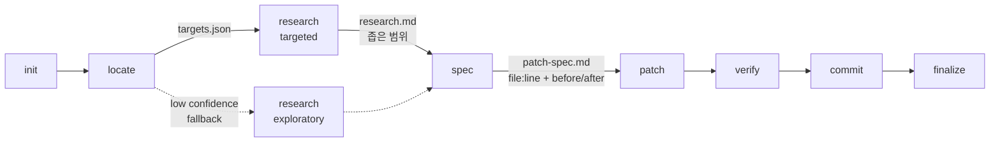

# RFC v7.0 — Surgical Pipeline (Target-First 패러다임)

> **Status**: Draft / Discussion
> **Depends on**: v6.1 (Universal Locate가 도입되어 있어야 함)
> **Created**: 2026-04
> **Decision deadline**: v6.1 안정화 후

---

## Context

Vela의 standard(large) 파이프라인은 *"이 코드베이스는 어떻게 생겼는가?"*를 묻는 광범위 분석으로 시작한다. 이건 신규 프로젝트나 광범위 리팩토링에는 적절하지만, *대부분의 일상 작업*("auth.ts에 입력 검증 추가" 같은)에는 명백히 과하다.

Anthropic 본가 Claude Code 공식 문서(`code.claude.com/docs/en/costs`)도 이 점을 직접 지적한다:

> *"Specific requests like 'add input validation to the login function in auth.ts' let Claude work efficiently with minimal file reads."*

즉 *"정확한 좌표 + 최소 파일 읽기"* 가 본질적으로 더 효율적이고 더 정확하다. v7.0 surgical은 이 패러다임을 Vela에 적용한다.

### v6.1과의 차이

v6.1의 universal locate가 도입되면 *모든 scale에서 좌표 식별이 결정론적*이 된다. 하지만 large 단계는 여전히 *광범위 plan 작성 + 추상 architecture 설계*를 한다. v7.0은 그 위에 한 단계 더 정밀화한다:

- **v6.1**: targets → research(targeted) → plan → execute (plan은 추상 architecture)
- **v7.0**: targets → research(targeted) → **spec** (file:line + before/after) → **patch** (명세 기반 적용)

핵심 차이: **plan은 "어떻게 설계할 것인가"를 추상적으로 묻고, spec은 "정확히 어떤 행동을 할 것인가"를 결정론적으로 명세한다.**

---

## 의도한 결과

| 차원 | v6.1 (locate만) | v7.0 surgical (+spec) |
|---|---|---|
| 좌표 정확도 | high | high |
| 설계 결정 정확도 | medium (plan이 추상적) | high (spec이 결정론적) |
| patch 회귀 위험 | medium | low (out-of-scope 명시) |
| audit trail 정밀도 | file 단위 | file:line 단위 + before/after |
| 평균 토큰 비용 (large 작업) | ~150-300k | **~100-150k** |
| scope creep 방지 | 약 (plan에 의존) | 강 (spec out-of-scope 차단) |

v6.1만으로도 비용 절감의 80%는 달성된다. v7.0은 *나머지 20% 비용 + 회귀 위험 + scope creep 방지* 를 노린다.

---

## 새 파이프라인 흐름



### 단계별 책임 분리

| 단계 | 답하는 질문 | 산출물 | 추정 토큰 |
|---|---|---|---|
| **init** | "이 작업의 메타데이터는?" | meta.json, pipeline-state.json | 0 (CLI) |
| **locate** | "어디에 있는가?" | `targets.json` (file:line + blast_radius) | 5-15k (대부분 0, semantic 폴백 시 ~3-5k) |
| **research(targeted)** | "이걸 바꿀 때 무엇을 알아야 하는가?" | `research.md` (caller list, import graph, similar pattern, risk) — **좁은 범위만** | 15-25k |
| **spec** | "정확히 어떻게 바꿀 것인가?" | `patch-spec.md` (before/after, test items, out-of-scope) | 10-20k |
| **patch** | "명세대로 적용" | 코드 변경 + task-summary.md | 20-50k |
| **verify** | "명세 ↔ 결과 일치?" | verification.md | 5-15k |
| **commit/finalize** | (변경 없음, v6.0과 동일) | diff.patch, report.md | 0 (CLI) |

**핵심 원칙**: research는 *컨텍스트만*, spec은 *행동만*. 이 경계가 두 단계의 중복을 막는다.

---

## 비용 비교

| 단계 | 현재 large (사용자 측정치) | v6.1 (locate만) | v7.0 surgical |
|---|---|---|---|
| 탐색 + 설계 | research 67k + plan 297k + plan-check 19k = **383k** | locate 10k + research(targeted) 25k + plan 50k = **85k** | locate 10k + research(targeted) 20k + spec 15k = **45k** |
| 구현 + 검증 | execute + review×3 + verify + diff-summary + learning ≈ 250k | execute + review + verify ≈ 100k | patch 40k + verify 15k = **55k** |
| **합계** | **~700-900k** | **~185k** | **~100-150k** |
| **절감 비율** | 기준 | ~75% ↓ | **~85% ↓** |

v7.0은 v6.1 대비 추가 ~30-50k 절감 + scope creep 방지 + 회귀 위험 감소.

---

## spec 단계의 정확한 책임

이건 v7.0의 **가장 중요한 설계 결정**이다. spec과 research가 중복되면 v7.0의 가치가 사라진다.

### research(targeted) — 컨텍스트 수집 (정보)

`{artifactDir}/research.md` 작성:
- targets.json의 primary 파일에 대한 caller list (누가 호출하는가)
- import graph (이 파일이 참조하는 것 / 이 파일을 참조하는 것)
- 기존 similar pattern (이 코드베이스에서 비슷한 것을 어떻게 해왔는가)
- 잠재적 risk (이 변경이 catch해야 할 엣지케이스)
- 재사용 후보 (이미 있는 함수/모듈을 활용할 수 있는가)

### spec — 결정론적 행동 명세 (action)

`{artifactDir}/patch-spec.md` 작성:

```markdown
# Patch Specification

## src/auth.ts:loginHandler (lines 42-89)

### Before (현재 동작)
- email/password 입력에 대한 검증 없음
- undefined.length 호출 가능 (null 참조 위험)
- 실패 응답: 500 Internal Server Error

### After (변경 후)
- 입력 검증 추가:
  - email: non-empty + RFC5321 format
  - password: 8+ chars
- 검증 실패 시 400 Bad Request
- 검증 통과 시 기존 동작 유지

### Test additions (src/auth.test.ts)
- "rejects empty email"
- "rejects malformed email"
- "rejects short password"
- "passes valid credentials" (regression test)

### Explicitly out of scope
- rate limiting (별도 작업)
- password complexity rules (별도 작업)
- session refresh logic (이번 변경의 blast radius 밖)
- error logging format (별도 작업)
```

**경계**:
- research가 "이 파일이 어떻게 생겼는가" → spec이 "그래서 무엇을 바꿀 것인가"
- research는 *현재 상태*, spec은 *변경 행동*
- research는 *정보*, spec은 *결정*

이 경계를 명시적으로 강제하면 spec 작성자(planner 재활용 또는 신규 spec-writer)가 research를 그대로 복사하지 않는다.

---

## research(targeted) 활성화 메커니즘

v6.1의 universal locate가 자동으로 결정한다:

| locate confidence | project_mode | research 동작 |
|---|---|---|
| **high** | `targeted` | 좁은 범위 (caller/import/패턴/위험) — 이미 잠자던 코드 활성화 |
| **medium** | `targeted` + warning | 좁은 범위 + 경계 명시 |
| **low** | `exploratory` (현 동작) | 광범위 (현재 67k+) |
| 좌표 없음 | `bootstrap` (신규 프로젝트) | 기술 선택지 분석 |

**권장**: locate confidence가 high이면 무조건 targeted, low이면 exploratory 폴백. PM이 추측하지 않는다.

---

## Standard (legacy) 보존 케이스

surgical로 처리 불가하므로 `/vela:large`의 standard 파이프라인을 그대로 유지:

1. **Bootstrap** — 신규 프로젝트, 타겟 식별 불가 → locate가 빈 결과 → exploratory research → 추상 architecture plan 필요
2. **광범위 리팩토링** — blast_radius가 코드베이스 전체 → spec이 너무 커져서 의미 없음 → architecture 단위 plan이 적절
3. **Exploratory bug** — 원인 불명 → 가설 디버깅(researcher/hypothesis.md) 필요 → spec 작성 전에 원인 발견이 우선

이 3개 케이스에서는 사용자가 명시적으로 `/vela:large`를 호출하면 기존 standard 12단계가 그대로 작동한다. **v7.0이 standard를 폐기하지 않는다 — 병존**.

### 결정 매트릭스

| 작업 유형 | 권장 명령 | 발동 파이프라인 |
|---|---|---|
| 정확한 좌표가 명확한 일상 작업 | `/vela:fix` | surgical (locate→research-targeted→spec→patch) |
| 명확하지만 작은 변경 | `/vela:small` | trivial + locate |
| 중간 규모 기능 추가 | `/vela:medium` | quick + locate |
| 광범위 리팩토링, 신규 모듈 | `/vela:large` | standard + locate (exploratory research) |
| 원인 불명 버그 (TDD 루프) | `/vela:ralph` | ralph + locate |
| 문서/설정 수정 | `/vela:hotfix` | hotfix + locate |

`/vela:fix`가 신규 명령으로 추가되며, 일상 작업의 default 권장이 된다.

---

## 영향 파일 (대략 6-9개)

**신규**:
- `scripts/agents/vela-spec-writer.md` — spec 단계 전용 에이전트 (Sonnet, ~100줄)
  - **또는** 기존 `vela-planner.md`를 재활용하고 frontmatter에 `mode` 분기 (더 적은 코드)
- `templates/pipeline.json` — `surgical` 파이프라인 추가, `scales` 매핑에 `fix → surgical` 추가
- `docs/surgical-pipeline-guide.md` — 사용자 가이드

**수정**:
- `scripts/cli/vela-engine.js`:
  - 새 exit_gate (`patch_spec_complete`, `targets_consumed`)
  - `--scale fix` 매핑 처리
- `scripts/agents/vela.md` — `/vela:fix` 절차 추가
- `scripts/agents/pm/pipeline-flow.md` — surgical 단계 오케스트레이션
- `scripts/agents/vela-executor.md` — input에 `specPath` 추가, patch-spec.md를 권위 source로 명시
- `scripts/agents/vela-verifier.md` — input에 `specPath` 추가, "out-of-scope 위반 검사" 절차 추가

**무수정** (v6.1에서 이미 처리):
- `scripts/agents/researcher/index.md` — targeted mode (v6.1에서 활성화)
- `scripts/shared/locate.js` — locate 모듈 (v6.1에서 작성)
- `scripts/shared/change-surface.js` — import graph (재활용)

---

## 결정 필요 (Q1~Q5)

- **Q1. spec 단계 에이전트**:
  - A. **기존 vela-planner 재활용** (`mode: spec` 주입) ← **권장** (새 코드 적음)
  - B. 신규 vela-spec-writer 에이전트 (책임 분리 명확)
  - C. PM이 직접 spec 작성 (LLM 호출 없음, 하지만 PM 부담 ↑)

- **Q2. 새 파이프라인 명칭**:
  - A. **`surgical`** ← **권장** (영문 직관, 의도 명확)
  - B. `precise`
  - C. `targeted`
  - D. `fix`
  - E. `scoped`

  명령어는 별도: 파이프라인 이름과 명령어 이름은 다를 수 있다 (예: 파이프라인 `surgical`, 명령어 `/vela:fix`).

- **Q3. 명령어 이름**:
  - A. **`/vela:fix`** ← **권장** (3글자, 직관적)
  - B. `/vela:precise`
  - C. `/vela:surgical`
  - D. `/vela:targeted`

- **Q4. 출시 형태**:
  - A. **v7.0 메이저 — standard와 병존**, 사용자가 명령어로 선택 ← **권장**
  - B. v7.0 메이저 — standard 폐기, surgical이 기본 (위험)
  - C. v6.2 마이너 — 옵션 기능으로 추가, opt-in (보수적)

- **Q5. spec out-of-scope 위반 catch 메커니즘**:
  - A. **verifier가 verify 단계에서 검사** ← **권장** (기존 verifier에 절차 추가)
  - B. PreToolUse 훅으로 patch 단계에서 실시간 차단 (강력하지만 false positive 위험)
  - C. diff-summary에서 사후 검사 (느림)

---

## 권장 답

| Q | 권장 |
|---|---|
| Q1 | A (planner 재활용 + mode 주입) — 새 에이전트 0개 |
| Q2 | A (`surgical`) — 의도 명확 |
| Q3 | A (`/vela:fix`) — 직관 |
| Q4 | A (병존) — standard는 bootstrap/refactor/bug 케이스에 필수 |
| Q5 | A (verifier 검사) — 새 메커니즘 0개 |

---

## 구현 순서 (권장)

v6.1이 안정화된 후 (벤치마크 + 3개 Change 머지 완료) 진행:

1. **Q1~Q5 결정** — RFC 검토 후 사용자 답변
2. **vela-planner.md 확장** (Q1=A 가정) — spec mode 추가, 기존 plan mode 유지
3. **templates/pipeline.json 확장** — `surgical` 파이프라인 정의 (steps_only + overrides)
4. **vela-engine.js exit_gate 추가** — `patch_spec_complete`
5. **vela-verifier.md 확장** — out-of-scope 위반 검사 절차
6. **PM 오케스트레이션 갱신** — `/vela:fix` 절차, vela.md + pipeline-flow.md
7. **테스트** — surgical 파이프라인 E2E 시나리오 (test-surgical-pipeline.sh)
8. **사용자 가이드** — docs/surgical-pipeline-guide.md
9. **README/SKILL.md 갱신** — `/vela:fix` 명령 안내
10. **v7.0 release**

---

## 위험 평가

### 위험 1 — research와 spec의 책임 경계 모호화

**리스크**: research가 *행동 권고*까지 하면 spec과 중복되어 두 단계의 합이 비싸짐.

**완화**:
- research 절차 문서에 *"행동 권고 금지, 정보 수집만"* 명시
- spec 절차 문서에 *"research를 그대로 복사 금지, 결정만 새로 작성"* 명시
- verifier가 spec과 research의 중복 비율 검사 (>50%면 warning)

### 위험 2 — out-of-scope 검사 false positive

**리스크**: spec에 명시 안 한 작은 변경(예: import 추가, 변수명 정리)이 차단되어 사용자 마찰.

**완화**:
- verifier 검사는 *경고 + 사용자 확인*만, 자동 차단 안 함
- 명확한 외부 파일 수정만 차단 (`out_of_scope` 리스트의 명시적 파일)
- "정당한 부수 변경 (import, 포맷팅)" 자동 허용 리스트

### 위험 3 — bootstrap/refactor/bug 케이스를 사용자가 잘못 분류

**리스크**: 사용자가 광범위 리팩토링인데 `/vela:fix`로 호출 → spec이 너무 커지거나 patch가 불완전.

**완화**:
- locate confidence가 low + blast_radius가 5 파일 이상이면 → surgical 단계에서 *"이 작업은 standard가 적절합니다"* 제안 (Scale Mismatch Guard와 동일 패턴)
- 사용자가 거절하면 surgical 그대로 진행 (사용자 의도 존중)

### 위험 4 — research(targeted)가 충분히 좁아지지 않음

**리스크**: targeted mode가 활성화되어도 researcher가 습관적으로 광범위 분석 → 비용 절감 효과 미미.

**완화**:
- researcher 시스템 프롬프트에 *"targeted mode에서는 targets.json의 파일과 그 직접 의존성 외 절대 읽지 않는다"* 강제
- artifact 검증: research.md에 references된 파일 수가 targets + 1단계 의존성을 넘으면 reviewer가 REJECT

---

## v7.1+ 후속 아이디어 (out of scope of this RFC)

이 RFC는 v7.0에 한정한다. 다음 아이디어는 별도 RFC로:

- **Patch dry-run** — patch 적용 전 사용자에게 diff preview + 승인 요청
- **Spec versioning** — 같은 spec으로 여러 시도 (실패 시 spec 자체를 수정해서 재시도)
- **Cross-spec dependency** — 하나의 spec이 다른 spec에 의존 (sprint와 통합)
- **AI-assisted spec review** — spec 자체에 대한 5차원 채점 (현재는 plan에만 적용)

---

## Status & Next Steps

- [ ] v6.1 머지 + 안정화
- [ ] v6.1 벤치마크 결과 확정
- [ ] Q1~Q5 사용자 결정
- [ ] vela-planner.md 확장 (mode: spec 분기)
- [ ] templates/pipeline.json 확장 (surgical 파이프라인 정의)
- [ ] verifier out-of-scope 검사 추가
- [ ] PM 오케스트레이션 갱신
- [ ] test-surgical-pipeline.sh 작성
- [ ] 사용자 가이드 작성
- [ ] v7.0 release

---

## 핵심 메시지

**v7.0 surgical은 새 패러다임이 아니라 v6.1의 자연스러운 정밀화다.** Vela의 핵심 자산("강제성", audit trail, 5차원 채점, gate-keeper/guard, TDD 3단계, ref_integrity)은 모두 보존되며, 단지 *"광범위 분석"이 *"정확한 좌표 + 결정론적 명세"로 대체*될 뿐이다.

이는 Anthropic의 공식 cost docs가 명시하는 *"specific requests minimize file reads"* 원칙을 Vela에 구조적으로 강제하는 것이다. 사용자가 specific하지 않은 요청을 해도 locate가 좌표를 결정하고 spec이 행동을 명세화하므로, 결과물은 결정론적이고 회귀 위험이 낮다.

**Vela가 "과한가"라는 사용자 질문의 진짜 답은 이것이다**: 현재의 광범위 분석 모드가 과하다. Surgical 모드를 도입하면 Vela의 강제성·audit·품질 게이트는 그대로 유지되면서 비용은 일상 작업에서 7-10배 줄어든다. **과함을 버리는 것이 아니라, 과함이 필요한 케이스에만 발동되도록 만드는 것**이 v7.0의 본질이다.
